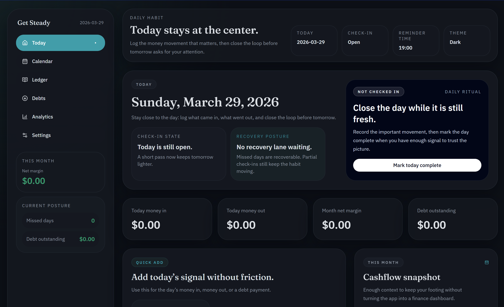

# Get Steady



Get Steady is a local-first desktop app for building a steady daily money habit through
manual tracking, debt visibility, and simple check-ins.

The product is intentionally narrow:

- manual by design
- local by default
- focused on awareness, not bank sync
- built to help users recover quickly after missed days

## Current Status

This repository contains the MVP desktop application and shared business logic for the
first public open-source release. The desktop app is usable locally today, but the project
is still early and some release-engineering work is intentionally deferred.

Implemented:

- Tauri desktop shell with React and TypeScript UI
- local SQLite storage with migration bootstrap
- daily check-ins, entry tracking, debt tracking, cashflow summaries, analytics, and backups
- CSV export and local database backup flows
- shared validation and summary logic in `@get-steady/core`
- public marketing site in `apps/web`

## Why This Exists

Most finance software optimizes for automation, aggregation, or endless dashboards.
Get Steady takes a calmer approach: a short manual routine that keeps money in, money out,
and debt progress visible without turning financial awareness into a second job.

## Privacy and Data Ownership

- Data stays on the local device.
- No account is required.
- The app works offline.
- Users can export entries and debt data to CSV.
- Database backups are created locally by the desktop app.

The SQLite database is created under the Tauri app data directory:

```text
<app-data>/data/steady.sqlite
```

Default subdirectories:

```text
<app-data>/backups/
<app-data>/exports/
```

Typical app data roots:

- Windows: `%APPDATA%` or `%LOCALAPPDATA%` under the Tauri app identifier path
- macOS: `~/Library/Application Support/`
- Linux: `~/.local/share/`

## Workspace Layout

- `apps/desktop`: Tauri desktop app, React UI, native SQLite command layer
- `apps/web`: marketing site and GitHub Pages deployment surface
- `packages/core`: shared schemas, date helpers, exports, summaries, and analytics logic
- `packages/ui`: shared UI package placeholder
- `docs`: product, tech, and planning notes

## Tech Stack

- Tauri 2
- React 19
- TypeScript
- Vite
- Tailwind CSS
- SQLite via Rust and `rusqlite`
- Zod
- TanStack Query
- Vitest

## Requirements

- Node.js 22+
- pnpm 10+
- Rust stable toolchain

## Quickstart

Install dependencies:

```bash
pnpm install
```

Start the desktop app in development:

```bash
pnpm --filter @get-steady/desktop tauri dev
```

Start the marketing site in development:

```bash
pnpm --filter @get-steady/web dev
```

Run the standard checks:

```bash
pnpm check
```

Run individual commands:

```bash
pnpm typecheck
pnpm lint
pnpm test
pnpm build
pnpm test:rust
```

Format the repository:

```bash
pnpm format
```

## Windows Releases

Windows installers are published from Git tags like `v0.1.0` through GitHub Actions.

Current release properties:

- Windows only
- unsigned installers for now
- release assets attached to GitHub Releases
- `SHA256SUMS.txt` included with each release
- GitHub provenance attestations generated for shipped assets

## Quality Gates

The public launch baseline includes:

- workspace typechecking
- ESLint for TypeScript and React code
- Prettier for repository formatting
- Vitest for frontend and shared logic tests
- Rust tests for the Tauri backend
- GitHub Actions CI, security, and CodeQL workflows
- Dependabot for npm, Cargo, and GitHub Actions updates

## Notes

- Debt payments are stored as normal entries linked to a debt and update the debt balance transactionally.
- The UI computes daily and monthly summaries, catch-up state, and analytics from `@get-steady/core`.
- Export uses friendly CSV headers. XLSX is not included in this pass.

## Contributing

Contributions are welcome, but the project is still tightening its public API and product
scope. Start with [CONTRIBUTING.md](CONTRIBUTING.md) before opening a pull request.

## Security

Please read [SECURITY.md](SECURITY.md) before reporting vulnerabilities.

## License

This project is released under the [MIT License](LICENSE).

## Desktop Versioning

Desktop releases use conventional commits plus `release-please`.

- Merge `feat:`, `fix:`, and breaking-change commits into `main`.
- `release-please` opens or updates a desktop release PR with the next semantic version.
- Merging that release PR creates the `vX.Y.Z` tag and GitHub Release.
- The Windows installer workflow publishes desktop artifacts from that tag.
- Repository maintainers must configure a `RELEASE_PLEASE_TOKEN` secret so release tags can trigger downstream release workflows.
